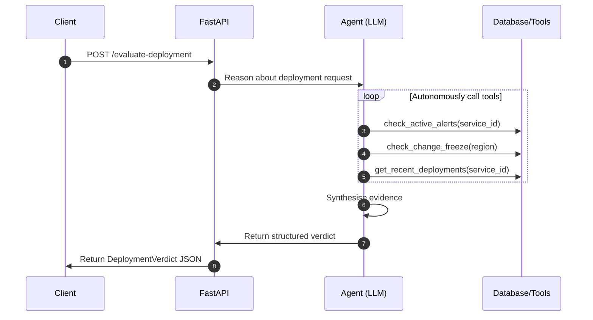

# Deployment Safety Advisor

AI-powered deployment safety evaluation agent built with GPT-4o-mini 
and tool calling. Evaluates deployment requests against live alert 
states, change freeze windows, and deployment history before returning 
a structured go/no-go verdict.

## Architecture



## Example

Input:
```json
{
  "service_id": "svc-payments",
  "service_name": "payments-service",
  "version": "v2.2.0",
  "target_region": "ap-mumbai-1",
  "deployed_by": "muthu"
}
```

Output:
```json
{
  "verdict": "NO_GO",
  "risk_score": 85,
  "safe_to_deploy": false,
  "reasons": [
    "Active CPU_HIGH alert on payments-service",
    "Change freeze active in ap-mumbai-1 — quarter-end freeze",
    "Most recent deployment v2.1.0 failed"
  ],
  "recommended_actions": [
    "Resolve active CPU alert before deploying",
    "Wait for change freeze window to end",
    "Review failure root cause from v2.1.0"
  ]
}
```

## Sample Evaluation Results

| Service                | Verdict | Risk |
|------------------------|---------|------|
| payments-service       | NO_GO   | 75 |
| auth-service           | NO_GO   | 85 |
| notification-svc       | GO      | 0 |
| config-manager         | GO      | 10 |
| deployment-svc         | GO      | 10 |

## Platform Extensibility

The framework has been redesigned into an extensible **Deployment Safety Platform** supporting plug-and-play components:

### 1. Database Adapters
Data retrieval is abstracted using the `DatabaseAdapter` Protocol. To integrate a new database (e.g., Postgres, MongoDB, Mock):
1. Implement the `DatabaseAdapter` protocol (see [database.py](file:///c:/Users/Manian%20Personal/Documents/deployment-safety-agent/app/database.py)).
2. Call `set_db(your_custom_adapter)` in your application initialization to register it.

### 2. Custom Tool Registration
Developers can add custom safety checkers (tools) without modifying the core agent logic:
1. Define a python function.
2. Annotate it using the `@registry.register(...)` decorator, providing a name, description, and the parameters schema.
3. The LLM agent will dynamically pick up the new tool, include it in its decision-making loop, and invoke it when appropriate.

## Design decisions

**Why tool calling over a single prompt?**
Single prompt approach requires stuffing all context upfront. 
Tool calling lets the agent decide what information it needs 
and fetch it dynamically — mirrors how a human engineer 
would investigate before approving a deployment.

**Why Pydantic for output?**
LLM outputs are non-deterministic. Pydantic enforces schema 
on every response — if the model hallucinates a field or 
returns wrong types, it fails loudly rather than silently 
corrupting downstream systems.

**Why SQLite for default mock data?**
Zero infrastructure overhead. The same pattern works with 
any database behind the tool functions — swap SQLite for 
Postgres or Oracle DB by implementing a custom `DatabaseAdapter` without changing agent logic.

## Setup

```powershell
python -m venv venv
venv\Scripts\activate
pip install -r requirements.txt
```

Create `.env`:
OPENAI_API_KEY=your_key_here

Seed database:
```powershell
python seed_db.py
```

Run:
```powershell
uvicorn app.main:app --reload --port 8000
```

Open `http://localhost:8000/docs` to test interactively.

## Background

This project extends the alert-aware deployment control framework 
I designed at Oracle Cloud Infrastructure — a platform governing 
deployments across 120+ OCI regions using Kafka-driven event 
processing and distributed locking. This agent adds an LLM reasoning 
layer that explains safety decisions in plain English and generates 
specific remediation guidance.

## Tech stack

Python · FastAPI · OpenAI GPT-4o-mini · Pydantic · SQLite · uvicorn